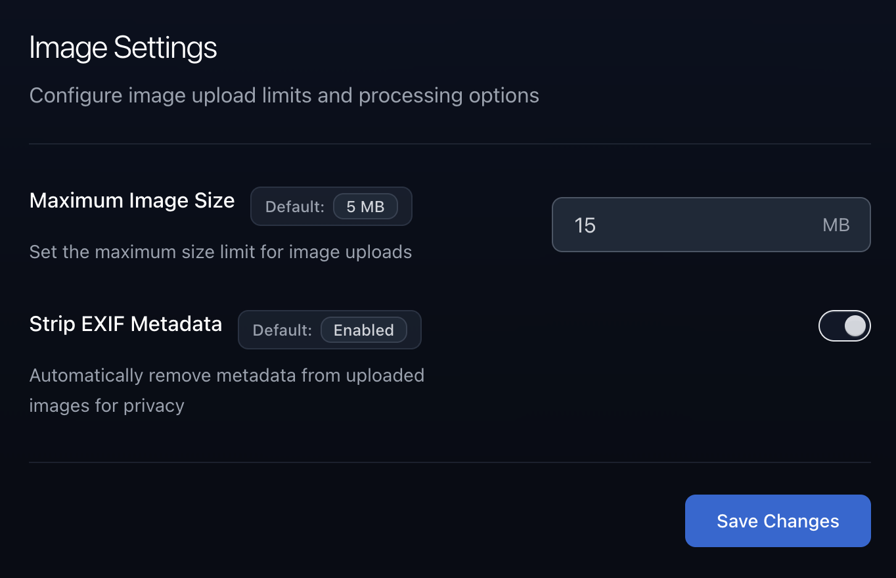
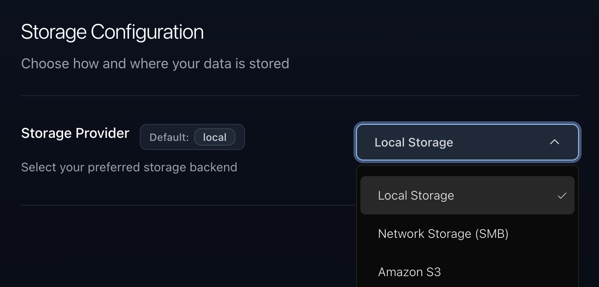
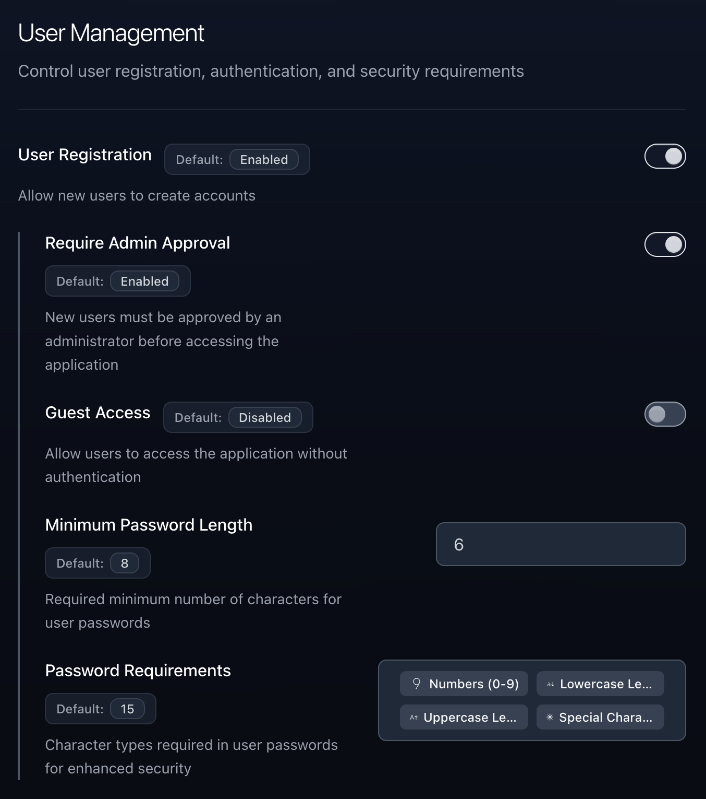

import { Steps, Aside } from '@astrojs/starlight/components';

<Aside type="caution" title="Important">
  The admin settings page is only accessible to users with the **Admin** role.
  See [Manage User Permissions](/reference/02-manage-user-permissions) for more
  information.
</Aside>

The admin settings page allows you to manage the application settings and users. You can access the admin settings page by navigating to `/admin` on your Slink instance.

## Image Settings

The image settings section allows you to configure how images are processed and stored.

**Available Settings:**

- **Maximum Image Size**: Control the maximum file size for image uploads (up to 50MB)
- **Strip EXIF Metadata**: Automatically remove metadata from uploaded images for privacy
- **Compression Quality**: Adjust JPEG compression quality (1-100, where 100 is highest quality)
- **Allow Only Public Images**: When enabled, all images are automatically set to public and visibility cannot be changed

<Aside type="note">
  These settings can also be configured using [environment variables](/configuration/01-environment-variables) if you prefer infrastructure-as-code approaches.
</Aside>

## Storage Settings

The storage settings allow you to configure where and how your images are stored. Slink supports multiple storage providers for different deployment scenarios.

**Available Storage Providers:**

- **Local Storage**: Store images on the local filesystem (default)
- **Network Storage (SMB)**: Store images on a network share using SMB/CIFS protocol
- **Amazon S3**: Store images in AWS S3 for cloud deployments

**Local Storage Configuration:**
- Images are stored in `/app/slink/images`
- Cache files are stored in `/app/slink/cache`
- Requires volume mounting for Docker deployments

**SMB Storage Configuration:**
- **Server Host**: IP address or hostname of your SMB server
- **Share Name**: Name of the SMB share to use
- **Username/Password**: Credentials for authentication
- **Workgroup**: SMB workgroup (optional, defaults to 'workgroup')

**Amazon S3 Configuration:**
- **Region**: AWS region where your bucket is located
- **Bucket Name**: Name of your S3 bucket
- **Access Key ID**: AWS access key for authentication
- **Secret Access Key**: AWS secret key for authentication

For detailed configuration information, see [Storage Providers](/reference/03-storage-provider) reference.

<Aside type="tip">
  Storage settings configured through the admin interface take precedence over environment variables, but require the application to be restarted to take effect.
</Aside>

## User Settings

The user settings allow you to configure platform user-related settings and access control.

**Available Settings:**

- **User Approval Required**: When enabled, new user registrations require admin approval before they can upload images
- **Allow Unauthenticated Access**: Allow non-logged-in users to view public images and use public routes
- **Minimum Password Length**: Set the minimum required password length for user accounts
- **Password Requirements**: Configure password complexity requirements using a bitmask system:
  - `1` - Require numbers
  - `2` - Require lowercase letters
  - `4` - Require uppercase letters  
  - `8` - Require special characters
  - Sum the values for multiple requirements (e.g., `15` requires all four types)

<Aside type="note">
  User settings help you balance security and usability based on your deployment environment and user base.
</Aside>
