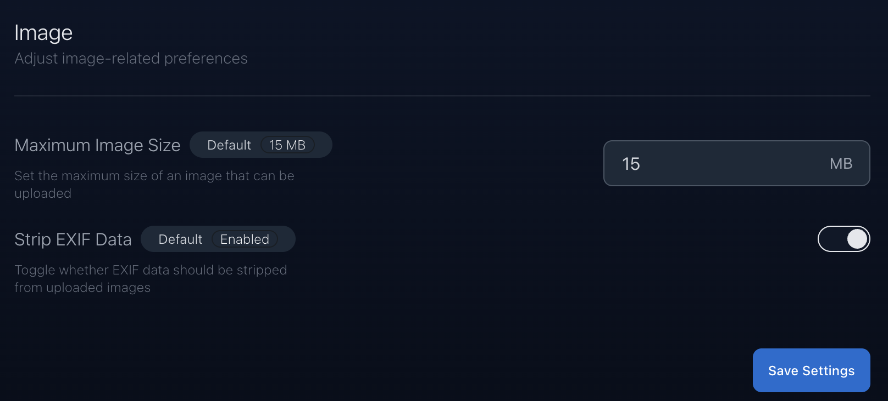
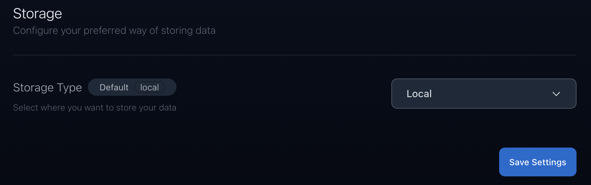
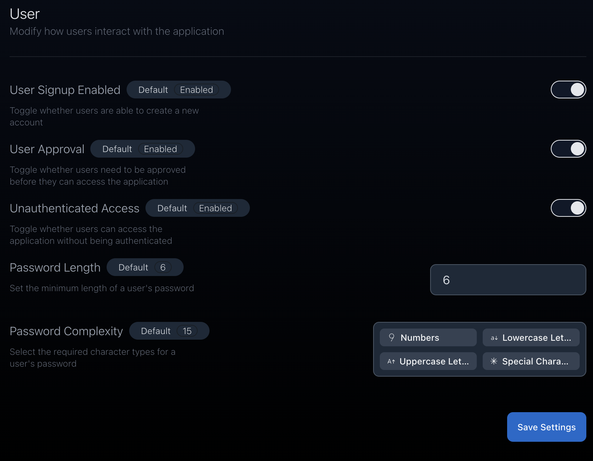

import { Aside } from '@astrojs/starlight/components';

<Aside type="caution" title="Important">
  The admin settings page is only accessible to users with the **Admin** role.
  See [Manage User Permissions](/reference/02-manage-user-permissions) for more
  information.
</Aside>

The admin settings page allows you to manage the application settings and users. You can access the admin settings page by navigating to `/admin` on your Slink instance.

## Image Settings

### Storage Settings

The storage settings allow you to configure the storage provider and the storage path. See [Storage Providers](/reference/03-storage-providers) for more information.

### User Settings

The user settings allow you to configure the platform user-related settings.

