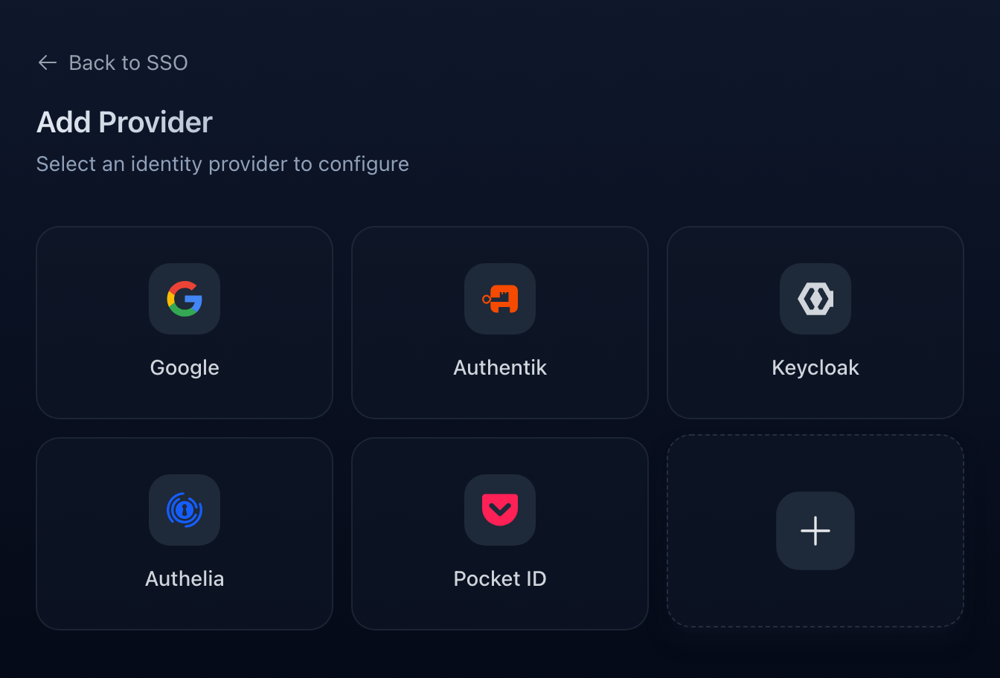
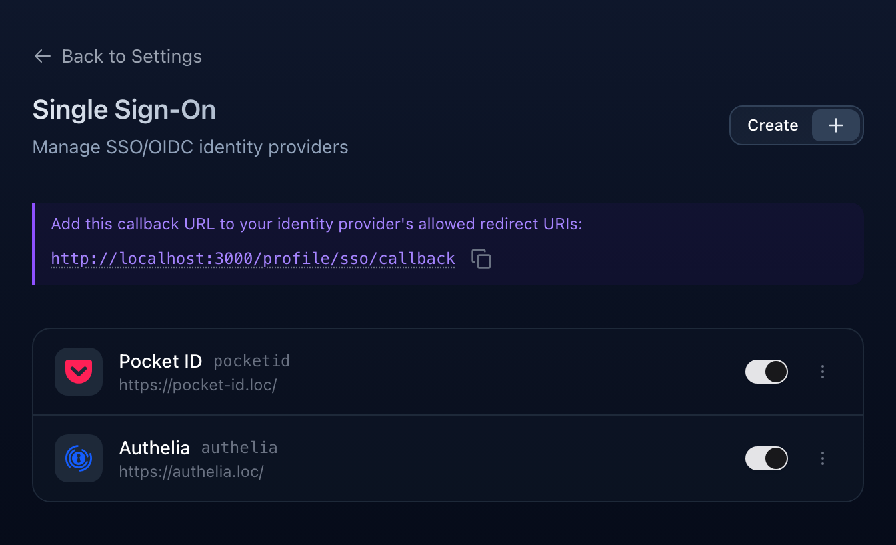
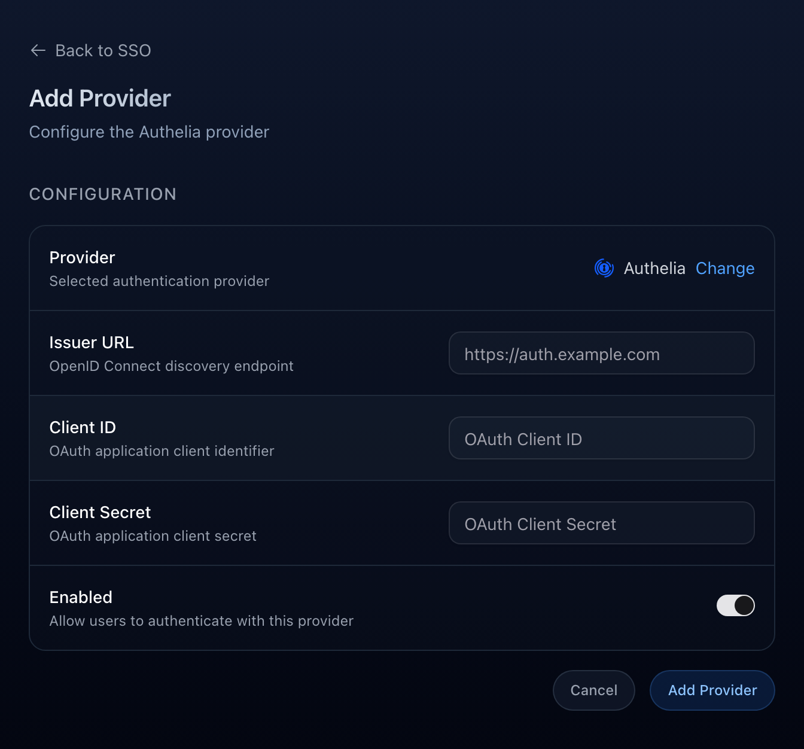

import { Aside, Steps } from '@astrojs/starlight/components';

Slink supports Single Sign-On through any OpenID Connect (OIDC) provider. Users sign in with an external identity provider instead of a Slink password, and accounts are matched or created automatically based on the verified email address.

Providers are configured entirely from the admin **Settings** page and stored encrypted in the database. There are no per-provider environment variables to manage.

## Supported Providers

Slink ships with presets for the most common providers, plus a **Custom** option for any other OIDC-compliant service.



| Provider | Issuer / Discovery URL |
| --- | --- |
| **Google** | Built in, no URL needed |
| **Authentik** | `https://authentik.example.com/application/o/slink/` |
| **Keycloak** | `https://keycloak.example.com/realms/your-realm` |
| **Authelia** | `https://auth.example.com` |
| **Pocket ID** | `https://pocket-id.example.com` |
| **Custom** | Any OIDC issuer URL |

<Aside type="note">
  Presets only prefill the provider name, icon, and scopes. Authentik, Keycloak,
  Authelia, Pocket ID, and Custom all use the same generic OIDC flow, so any
  standards-compliant provider works through the Custom option.
</Aside>

## Adding a Provider

<Steps>

1. Open **Settings → Single Sign-On** (`/admin/settings/sso`).

2. Copy the callback URL shown at the top of the page and add it to your identity provider's list of allowed redirect URIs.

   

3. Click **Create**, then choose a provider preset (or **Custom**).

4. Fill in the **Issuer URL**, **Client ID**, and **Client Secret** from your provider, then enable it.

   

</Steps>

### Provider Fields

| Field | Required | Description |
| --- | --- | --- |
| **Provider Name** | Custom only | Display label for the login button. |
| **Slug** | Custom only | URL-safe identifier used in the login route. Lowercase letters, numbers, and hyphens. |
| **Issuer URL** | Yes | The provider's base OIDC issuer. Slink appends `/.well-known/openid-configuration` automatically, so you do not need to include it. Not shown for Google, which uses a fixed issuer. |
| **Client ID** | Yes | OAuth client identifier from your provider. Stored encrypted. |
| **Client Secret** | Yes | OAuth client secret from your provider. Stored encrypted. |
| **Enabled** | No | Whether the provider appears on the login page. |

### Callback URL

Slink uses a single fixed callback path for every provider:

```text
https://your-slink-instance.com/profile/sso/callback
```

The host is taken from your [`ORIGIN`](/configuration/01-environment-variables/#general) environment variable. Register this exact URL with each identity provider, or sign-in will fail with a redirect URI mismatch.

## How Accounts Are Matched

Slink reads user details from the provider's ID token. For a sign-in to succeed, the token must contain:

| Claim | Purpose |
| --- | --- |
| `sub` | Stable unique identifier for the external account. |
| `email` | Used to match or create the Slink account. |
| `email_verified` | Must be `true`. Slink rejects sign-in if the email is unverified. |
| `name` or `preferred_username` | Display name. `preferred_username` is used as a fallback. |

<Aside type="caution" title="Email must be verified">
  The email address must be marked as verified by the identity provider. If the
  ID token is missing the `email_verified` claim or returns it as `false`, Slink
  throws an exception and the login fails. Make sure the account's email is
  verified at your provider before signing in.
</Aside>

When someone signs in, Slink links the external account by `sub`, falls back to matching an existing user by `email`, and otherwise creates a new account. New accounts still respect your [`USER_ALLOW_REGISTRATION` and `USER_APPROVAL_REQUIRED`](/configuration/01-environment-variables/#users--access) settings, so a first-time SSO user may need admin approval before they can sign in.

<Aside type="note">
  Slink requests the `openid email profile` scopes and always uses PKCE
  (`S256`). Client credentials are sent to the token endpoint using the
  `client_secret_post` method.
</Aside>

### SSL Verification

If your provider uses a self-signed or otherwise untrusted certificate (common in local or homelab setups), Slink's calls to the discovery, token, and JWKS endpoints will fail. Set `OAUTH_VERIFY_SSL=false` on the Slink container to disable certificate verification.

| Variable | Description | Default |
| --- | --- | --- |
| `OAUTH_VERIFY_SSL` | Verify the provider's SSL certificate during the OIDC flow.<span class="note">Set to `false` only for trusted internal providers with self-signed certificates.</span> | `true` |

## Authelia

Authelia works with Slink, but unlike most providers it does **not** include the `email` and `email_verified` claims in the ID token by default. Because Slink matches users by verified email, sign-in fails until you add a [claims policy](https://www.authelia.com/integration/openid-connect/openid-connect-1.0-claims/) that puts those claims in the ID token.

Add a claims policy and reference it from the Slink client:

```yaml
identity_providers:
  oidc:
    claims_policies:
      with_email:
        id_token:
          - 'email'
          - 'email_verified'
    clients:
      - client_id: 'slink'
        client_name: 'Slink'
        client_secret: '{{ env "SLINK_OIDC_CLIENT_SECRET" }}'
        public: false
        claims_policy: 'with_email'
        authorization_policy: 'one_factor'
        redirect_uris:
          - 'https://your-slink-instance.com/profile/sso/callback'
        scopes:
          - 'openid'
          - 'profile'
          - 'email'
        grant_types:
          - 'authorization_code'
        response_types:
          - 'code'
```

In the Slink admin form, set the **Issuer URL** to your Authelia base URL (for example `https://auth.example.com`) and use the matching **Client ID** and **Client Secret**.

<Aside type="tip" title="Using LLDAP as a backend">
  LLDAP does not expose an `email_verified` attribute, so Authelia cannot pass
  it through. Define a custom claim that forces it to `true`:

  ```yaml
  definitions:
    user_attributes:
      always_true:
        expression: 'true'
  identity_providers:
    oidc:
      claims_policies:
        with_email:
          id_token:
            - 'email'
            - 'email_verified'
          custom_claims:
            email_verified:
              attribute: 'always_true'
  ```
</Aside>
