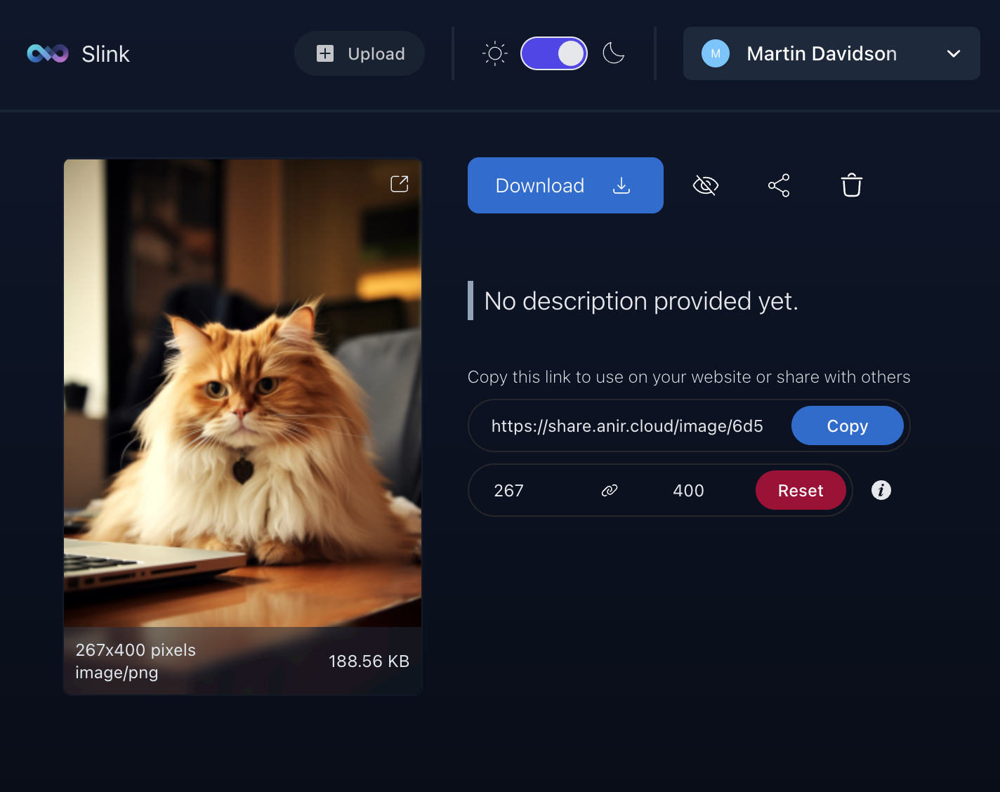

import { Aside } from '@astrojs/starlight/components';

  
  
  
  

Welcome to **Slink**, a powerful self-hosted image sharing platform designed to give users complete control over their media sharing experience. Built with [Symfony](https://symfony.com/) and [SvelteKit](https://kit.svelte.dev/), Slink enables seamless and secure image sharing without relying on third-party services.

## Why Slink?

Slink solves the problem of sharing images with friends, family, and colleagues in a private, self-hosted environment. It's also ideal for:

- **Artists**: Showcase artwork in a community-focused platform.
- **Developers**: Host and share screenshots for GitHub, portfolios, blogs, and more.
- **Anyone**: Take control of image privacy and hosting.

---

## Features

<Aside>
  \*HEIC and TIFF images are converted to JPG format before being saved for
  better compatibility.
</Aside>

- **Image Upload**: Upload images in formats like PNG, JPG, WEBP, SVG, BMP, ICO, GIF, AVIF, HEIC*, and TIFF*.
- **Upload History**: View and manage your complete upload history.
- **Share Links**: Share images with customizable links and sizes.
- **Explore Images**: Browse public uploads from other users.
- **Authentication**: Secure sign-up and login for platform access.
- **User Approval**: Approve users before granting upload permissions.
- **Dashboard**: Analyze data with advanced admin statistics.
- **Dark Mode**: Switch effortlessly between Dark and Light themes.
- **Storage Providers**: Integrate with local, SMB, or AWS S3 storage solutions.
- **Settings Configuration**: Manage users, storage, and other settings.
- **Public API**: Access the platform programmatically (Still needs to be documented).

---

## Upcoming Features

<Aside type="caution" title="Important">
  Those might be changed or removed in the future according to the community
  feedback and priorities.
</Aside>

- **Multiple Image Upload**: Allow users to upload multiple images at once.
- **Tags**: Allow users to tag their images for better organization and search.
- **Collections**: Users can create collections of images and share them with others.
- **Password Protection**: Allow users to protect their images with a password.
- **Image Compression**: Compress images to reduce the file size and improve performance.
- **CDN Support**: Support for _CDN_ _providers_ to reduce the load on the self-hosted server.
- **Storage Providers**: Extend the support for additional storage providers.
- **Anonymous Upload**: Allow users to upload images without signing up.
- **Password Recovery**: Password recovery for users who forgot their password.
- **Email Notifications**: Email notifications for user approval, password reset, etc.
- **ShareX Integration**: Provide a ShareX configuration file for easy integration with the platform.
- **URL Shortening Integration**: Integration with URL shortening services.
- **(Optional) Database Support**: Support for additional databases like _MySQL_, _PostgreSQL_, etc.
- **(Optional) GPU acceleration**: Use GPU acceleration for image processing to improve performance.
- **(Experimental) Short Video Support**: Allow users to upload short videos and perform basic editing.
