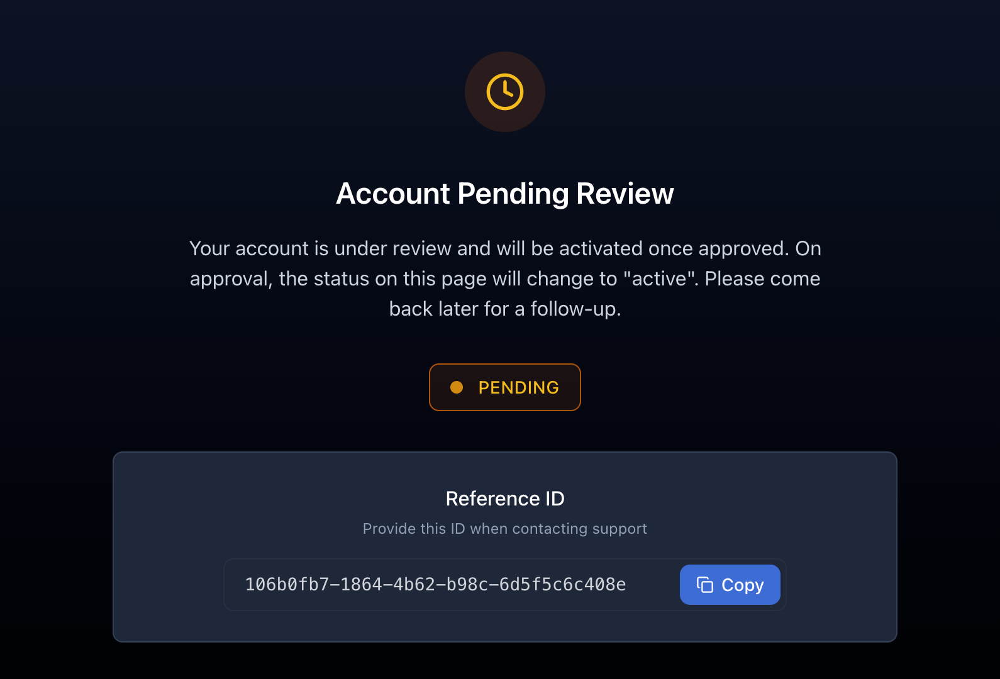
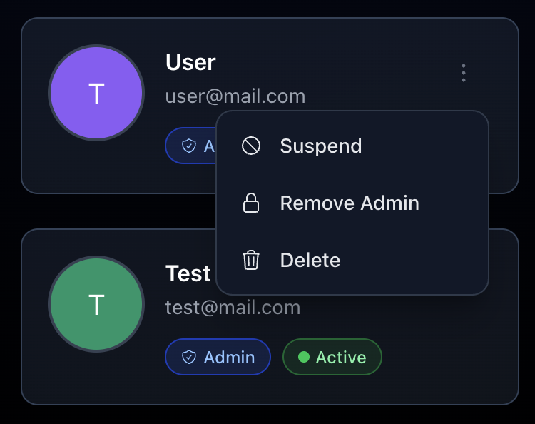

import { Aside } from '@astrojs/starlight/components';


By default, the application requires user approval before they can upload images. You can disable this feature by setting the `USER_APPROVAL_REQUIRED` environment variable to `false`.

If the user approval is enabled, you will have to activate the users manually with CLI command:

```bash
docker exec -it slink slink user:activate --email=<user-email>
```

or

```bash
docker exec -it slink slink user:activate --uuid=<user-id>
```

Newly registered users will be seeing the following message:



After the user is approved, they will be able to log in and upload images.

<Aside type="tip">
  Users can be also managed from the admin user management page.
</Aside>


