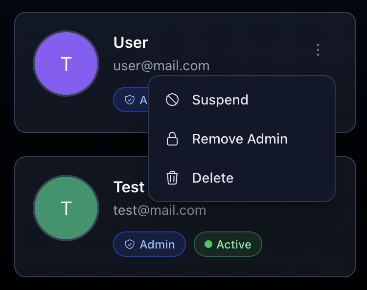

import { Aside } from '@astrojs/starlight/components';


The application has two user roles: **User** and **Admin**. By default, all users are assigned the **User** role.

To promote a user to the **Admin** role, you can use the following CLI command:

```bash
docker exec -it slink slink user:grant:role --email=<user-email> ROLE_ADMIN
```

To demote a user from the **Admin** role, you can use the following CLI command:

```bash
docker exec -it slink slink user:revoke:role --email=<user-email> ROLE_ADMIN
```

Alternatively, you can change the user role directly from the admin dashboard.



<Aside type="note">
  Admin users have access to the admin dashboard and can manage users and
  settings. There is no granular permission system in place yet. If it becomes a
  requested feature, it will be added in the future.
</Aside>
